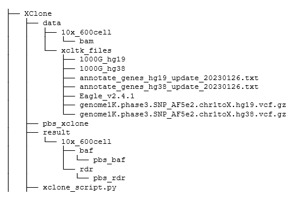
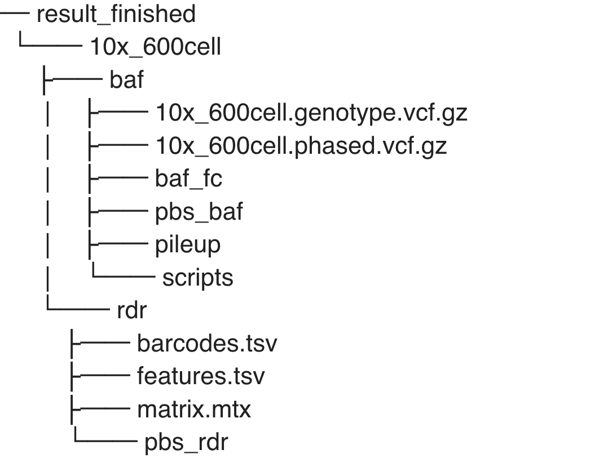

# Hands-on Workshop on CNA Detection in Single-Cell RNA-Sequencing Data

- Instructors: Prof. Yuanhua HUANG, Rongting HUANG and Xianjie HUANG

- Date & Time: 2:00 pm - 5:30 pm, Friday, July 19, 2024

- Venue: Knowledge Hub, Yu Chun Keung Medical Library


## File architecture in all training accounts




## Program rundown

- Overview of XClone and CNA analysis in single-cell and spatial RNA-seq.   **Prof. Yuanhua Huang**  `(2:15-2:30 pm)`

- One click for InferCNV-like results (~3min) via `XClone RDR Module`  **Rongting Huang** `(2:30-3:00 pm)`

- Preprocessing toolkit `xcltk` to generate (allele-specific) counts from BAM file  **Xianjie Huang** `(3:00-4:00 pm)`
    - Detailed introduction of the 3-steps in `xcltk` (3:00-3:15 pm)
    - Demo in shell (3:00-4:00 pm)

- XClone pipeline to run RDR module, BAF module and Combine module **Rongting Huang** `(4:00-5:00 pm)`
    - Detailed introduction of the 3 modules in `XClone` (4:00-4:15 pm)
    - BCH869 Demo in Colab (4:15-4:30 pm)
    - GX109 Demo in shell (4:30-5:00 pm)


## Preprocessing

- xcltk: https://github.com/hxj5/xcltk

- slides: [xcltk-workshop](https://github.com/Rongtingting/xclone-data/blob/main/CPOS_Workshop/xcltk%20-%20workshop%20-%20XJ.pdf)

The submission of each pbs script would be simply: `qsub <pbs_script>`
e.g., `qsub pbs_baf`

[pbs_rdr](https://github.com/Rongtingting/xclone-data/blob/main/CPOS_Workshop/pbs_rdr)

[pbs_baf](https://github.com/Rongtingting/xclone-data/blob/main/CPOS_Workshop/pbs_baf)


- xcltk preprocessing output




## XClone

- github: https://github.com/single-cell-genetics/XClone

- tutorial: https://xclone-cnv.readthedocs.io/en/latest/


### demo

These demo can be used in [Google Colab](https://colab.google/) directly.


```python
pip install xclone
```


- [GX109_demo_notebooks](https://github.com/Rongtingting/xclone-data/tree/main/demo/GX109_demo_notebooks)

- [BCH869 demo](https://github.com/Rongtingting/xclone-data/blob/main/examples/BCH869_XClone_tutorials.ipynb)

- [colab](https://colab.research.google.com/github/Rongtingting/xclone-data/blob/main/demo/GX109_demo_notebooks/GX109_scRNA_RDR_fromxcltk.ipynb)

- [bch869 colab](https://colab.research.google.com/github/Rongtingting/xclone-data/blob/main/examples/BCH869_XClone_tutorials.ipynb)


### shell script

The submission of the pbs script would be simply: `qsub pbs_xclone`

[pbs_xclone](https://github.com/Rongtingting/xclone-data/blob/main/CPOS_Workshop/pbs_xclone)

[xclone_script](https://github.com/Rongtingting/xclone-data/blob/main/CPOS_Workshop/xclone_script.py)


[read/load data](https://xclone-cnv.readthedocs.io/en/latest/API.html#read-load)

[Getting started](https://xclone-cnv.readthedocs.io/en/latest/getting_started.html)


